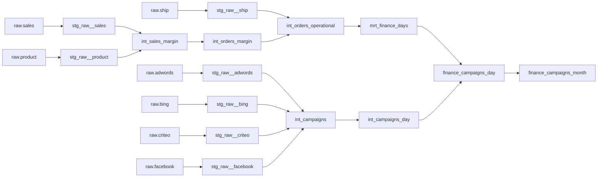

Ce projet **dbt** modélise des données **marketing** et **commerciales** d’un e-commerce (inspiré de l’univers Greenweez). Il consolide plusieurs canaux d’acquisition (Adwords, Bing, Criteo, Facebook) ainsi que les données de ventes, de produits et de livraison afin de construire des modèles financiers à des granularités **journalière** et **mensuelle**. L’objectif final est de fournir une base fiable pour analyser la performance des campagnes et piloter la rentabilité.

---

## 🎯 Objectifs du projet

* Regrouper des sources marketing multiples et hétérogènes dans un même référentiel
* Mettre en place une couche **staging** pour nettoyer, standardiser et fiabiliser les données
* Construire des modèles **intermediate** pour calculer coûts, marges et indicateurs de performance
* Produire des data marts Finance dédiés, notamment **mrt_finance_days** et **finance_campaigns_month**
* Offrir une vision unifiée : campagnes, ventes, marge, coûts logistiques et ROI

---

## 🧱 Architecture du projet

Le projet suit une approche Analytics Engineering structurée en couches (sources → staging → intermediate → marts) :

### 🗂 Structure dbt

```text
models/
├── staging/
│   ├── raw_ads/
│   │   ├── stg_raw__bing.sql
│   │   ├── stg_raw__adwords.sql
│   │   ├── stg_raw__criteo.sql
│   │   └── stg_raw__facebook.sql
│   ├── raw_sales/
│   │   ├── stg_raw__sales.sql
│   │   ├── stg_raw__product.sql
│   │   └── stg_raw__ship.sql
├── intermediate/
│   ├── int_campaigns.sql
│   ├── int_campaigns_day.sql
│   ├── int_sales_margin.sql
│   ├── int_orders_margin.sql
│   └── int_orders_operational.sql
├── marts/
│   ├── mrt_finance_days.sql
│   ├── finance_campaigns_day.sql
│   └── finance_campaigns_month.sql
```

---

## 🔍 Description des principales tables

### 🟦 **Staging (stg_raw__)**

Cette couche prépare les données brutes en appliquant les transformations “fondation” : nettoyage, renommage, typage et harmonisation des champs provenant des différentes plateformes.

* `stg_raw__bing`
* `stg_raw__adwords`
* `stg_raw__criteo`
* `stg_raw__facebook`
* `stg_raw__sales`
* `stg_raw__product`
* `stg_raw__ship`

### 🟧 **Intermediate (int__)**

Les modèles intermédiaires unifient et enrichissent les données afin de produire les métriques nécessaires au pilotage :

* `int_campaigns` : consolidation des sources marketing (structure homogène)
* `int_campaigns_day` : agrégation journalière des dépenses et KPI marketing
* `int_sales_margin` : calcul de marge au niveau produit / vente
* `int_orders_margin` : marge au niveau commande
* `int_orders_operational` : vision opérationnelle des commandes (livraison, coûts associés, etc.)

### 🟥 **Finance Marts**

Les marts exposent des tables prêtes pour la BI et les équipes Finance / Acquisition :

* `mrt_finance_days` : consolidation journalière (ventes + coûts + marketing)
* `finance_campaigns_day` : suivi quotidien du ROI par campagne
* `finance_campaigns_month` : vue mensuelle des performances (CAC, ROAS, marge)

---

## 🧪 Tests & Documentation

Le projet inclut notamment :

* Tests `unique` et `not null` sur les identifiants clés
* Tests `relationships` pour sécuriser les jointures entre modèles
* Contrôles de cohérence sur les dates et les montants

La documentation dbt peut être générée et consultée via :

```bash
dbt docs generate
dbt docs serve
```

---

## 🧵 Lineage

Le graphe ci-dessous illustre la chaîne de transformation complète, des sources brutes jusqu’aux tables Finance finales :

<!-- Option 1: Image du lineage (recommandé si tu exportes le DAG en PNG) -->


<!-- Option 2: Lineage en Mermaid (affiché directement dans GitHub) -->



---

## 🚀 Exécution du projet

Pour installer les dépendances et construire l’ensemble des modèles :

```bash
dbt deps
dbt run
dbt test
dbt docs generate
```

---

## 📈 Résultats

* Harmonisation de **4 canaux marketing** (Adwords, Bing, Criteo, Facebook)
* Mise en place d’un pipeline de calcul de **marge** jusqu’au niveau commande
* Consolidation Finance & Acquisition dans des tables prêtes pour le reporting
* Construction de marts journaliers et mensuels exploitables en BI

---

## 👩‍💻 Technologies utilisées

* **dbt Core**
* **BigQuery**
* **SQL**
* **dbt tests & documentation**
* **Visualisation lineage dbt**
